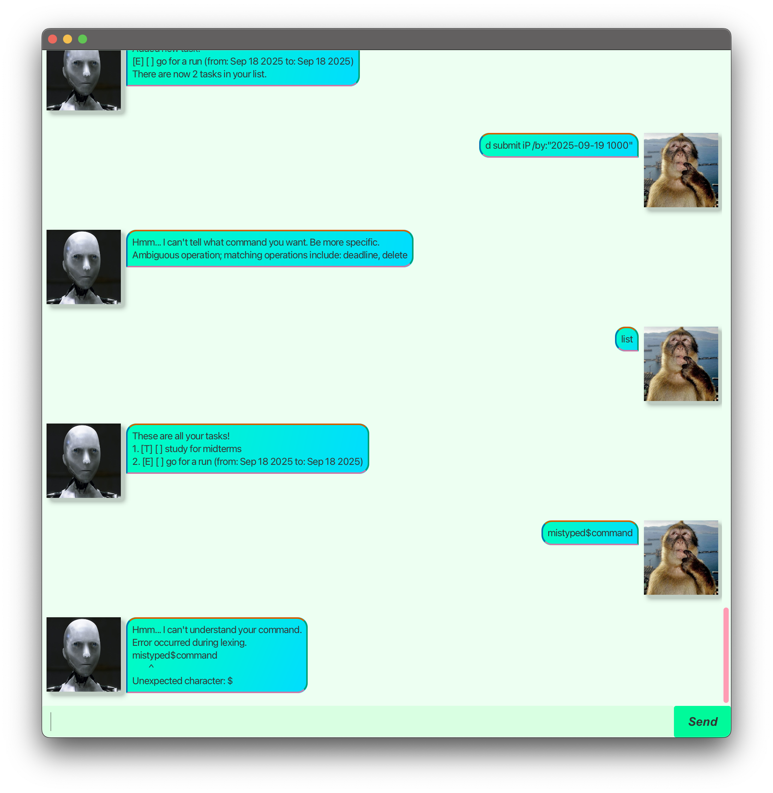

# Clanker User Guide



Get a clanker to help organise all of your tasks today!

---

## Command Reference

This command reference provides details for all the commands you can use to manage your tasks. Each command follows a
simple structure: an **imperative** (the command word), followed by **parameters** (like a task description), and
sometimes **options** (like a date, prefixed with `/`).

-----

## Viewing Tasks

### **`list`**

Use the **`list`** command to display all your current tasks. Each task will be shown with a reference index, which
you'll need for other commands like `mark`, `unmark`, and `delete`.

* **Syntax**: `list`
* **Example**:
  ```
  list
  ```

-----

## Adding Tasks

You can add three types of tasks: todos, deadlines, and events.

### **`todo`**

Adds a simple task with a description.

* **Syntax**: `todo <task description>`
* **Example**:
  ```
  todo Read chapter 4 of the textbook
  ```

### **`deadline`**

Adds a task that must be completed by a specific date and time. The date format is `YYYY-MM-DD HHMM`.

* **Syntax**: `deadline <task description> /by:"<YYYY-MM-DD HHMM>"`
* **Example**:
  ```
  deadline Submit final essay /by:"2025-11-15 2359"
  ```

### **`event`**

Adds an event or appointment that occurs over a specific time range.

* **Syntax**: `event <task description> /from:"<YYYY-MM-DD HHMM>" /to:"<YYYY-MM-DD HHMM>"`
* **Example**:
  ```
  event Project sync meeting /from:"2025-09-22 1400" /to:"2025-09-22 1500"
  ```

-----

## Managing Tasks

These commands help you modify existing tasks. You will need the task's **index** from the `list` command.

### **`mark` & `unmark`**

Use **`mark`** to set a task's status to "done". Use **`unmark`** to revert it to "not done".

* **Syntax**: `mark <index>` or `unmark <index>`
* **Example**: To mark the second task in your list as done:
  ```
  mark 2
  ```
* **Example**: To unmark it:
  ```
  unmark 2
  ```

### **`delete`**

Permanently removes a task from your list.

* **Syntax**: `delete <index>`
* **Example**: To delete the fifth task:
  ```
  delete 5
  ```

-----

## Finding and Exiting

### **`find`**

Searches the descriptions of all tasks for a specific word or phrase. The search is case-sensitive.

* **Syntax**: `find <search term>`
* **Example**: To find all tasks containing the word "meeting":
  ```
  find meeting
  ```

### **`bye`**

Saves all changes and exits the application. 👋

* **Syntax**: `bye`
* **Example**:
  ```
  bye
  ```